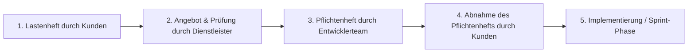

# 05-01: LF 5.1 Lastenheft vs. Pflichtenheft & Anforderungserhebung

Dieses Modul behandelt die Abgrenzung von Lastenheft und Pflichtenheft, deren chronologischen Ablauf im Projekt, Methoden zur Extraktion technischer Fakten aus unstrukturierten Texten sowie Techniken zur Anforderungserhebung.

---

## 1. Lastenheft vs. Pflichtenheft

| Kriterium | Lastenheft (Requirements Specification) | Pflichtenheft (Functional Specification) |
| :--- | :--- | :--- |
| **Urheber / Autor** | **Auftraggeber** (Kunde / Fachbereich) | **Auftragnehmer** (Entwicklerteam / Dienstleister) |
| **Fokus / Frage** | **WAS** und **WOZU** soll umgesetzt werden? | **WIE** und **WOMIT** wird es technisch umgesetzt? |
| **Inhalt** | Problemstellung, Zielsetzung, Rahmenbedingungen, fachliche Gesamtanforderungen. | Technische Architektur, Datenmodelle, APIs, konkrete GUI-Entwürfe, Zeitplan. |
| **Verbindlichkeit** | Grundlage für die Ausschreibung / Angebotseinholung. | Vertagliche Grundlage für die Abnahme des Endprodukts. |

### Chronologischer Projektablauf

---

## 2. Anforderungserhebung & Unstrukturierte Daten

### Extraktion technischer Fakten
Kundenformulierungen sind häufig emotional, vage oder enthalten subjektive Präferenzen. Entwickler müssen diese in **objektive technische Fakten** übersetzen.

* **Subjektive Aussage:** *"Die Anwendung muss extrem schnell reagieren und modern aussehen, weil ich altmodische Buttons hasse!"*
* **Objektiver Fakt (Anforderung):** Response-Time der REST-API muss unter 200ms liegen (Latenz); UI muss responsive nach Material Design Standards umgesetzt werden.

### Offene Interviewfragen
Um versteckte Anforderungen aufzudecken, werden offene Fragen (W-Fragen) genutzt:
* *"Welche konkreten Arbeitsschritte führen Sie aktuell aus, wenn ein neuer Auftrag eingeht?"*
* *"Was passiert im System, wenn ein Lieferant nicht erreichbar ist?"*

---

## FIAE-Zusammenfassung
Entwickler prüfen das Lastenheft des Kunden auf Machbarkeit, trennen persönliche Präferenzen von technischen Notwendigkeiten und überführen die Anforderungen in ein präzises, abnahmesicheres Pflichtenheft.
