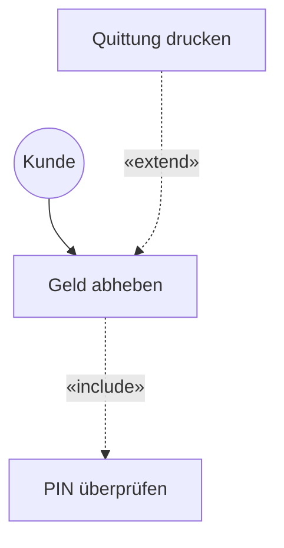

# 05-04: LF 5.2 UML 2.0 – Anwendungsfall- (Use Case) & Klassendiagramme

Dieses Modul behandelt die UML 2.0 Modellierung von Systemgrenzen, Akteuren und Anwendungsfällen sowie die detaillierte objektorientierte Strukturierung über Klassendiagramme.

---

## 1. UML Use Case Diagramm (Anwendungsfalldiagramm)

Das Use Case Diagramm beschreibt das äußere Verhalten eines Systems aus Sicht der Anwender (**Akteure**).

### Beziehungsarten in Use Case Diagrammen
* **Akteur $\rightarrow$ Use Case:** Verbindungslinie (Assoziation), wer den Anwendungsfall anstößt.
* **«include»-Beziehung:** Ein Anwendungsfall schließt einen anderen zwingend ein (erforderlicher Teilschritt).
* **«extend»-Beziehung:** Ein Anwendungsfall erweitert einen anderen optional unter einer bestimmten Bedingung (Erweiterungspunkt).

---

## 2. UML Klassendiagramm (Class Diagram)

Das Klassendiagramm beschreibt die statische Struktur eines objektorientierten Systems.

### Dreiteiliger Aufbau einer UML-Klasse
1. **Klassenname** (oben)
2. **Attribute** (Mitte: `- attributName: Datentyp`)
3. **Methoden / Operationen** (Unten: `+ methodeName(param: Typ): Rückgabetyp`)

### Sichtbarkeits-Modifizierer (Encapsulation)
* `+` **Public:** Überall sichtbar.
* `-` **Private:** Nur innerhalb der eigenen Klasse sichtbar.
* `#` **Protected:** In der eigenen Klasse und abgeleiteten Klassen sichtbar.
* `~` **Package / Default:** Nur innerhalb desselben Pakets sichtbar.

### OOP-Beziehungsarten

| Beziehung | UML-Symbol | Beschreibung | FIAE-Praxisbeispiel |
| :--- | :--- | :--- | :--- |
| **Vererbung (Generalisierung)** | Durchgezogene Linie mit weißer Pfeilspitze | `is-a` Beziehung (Subklasse erbt von Superklasse). | `Manager` erbt von `Mitarbeiter`. |
| **Assoziation** | Durchgezogene Linie | Logische Beziehung/Kenntnisbeziehung zwischen Klassen. | `Bestellung` kennt `Kunde`. |
| **Aggregation** | Durchgezogene Linie mit weißer Raute | `has-a` Beziehung (Ganzes-Teiles-Verhältnis; Teile existieren unabhängig weiter). | `Team` hat `Entwickler` (Entwickler existiert auch ohne Team). |
| **Komposition** | Durchgezogene Linie mit schwarzer Raute | Existenzabhängiges Ganzes-Teiles-Verhältnis (Starke Existenzabhängigkeit). | `Rechnung` hat `Rechnungszeile` (Zeile existiert nicht ohne Rechnung). |

---

## FIAE-Zusammenfassung
Entwickler nutzen Use-Case-Diagramme zur Klärung von Fachanforderungen mit Stakeholdern und übersetzen UML-Klassendiagramme (Sichtbarkeiten, Komposition vs. Aggregation) direkt in objektorientierten Code (z. B. Java, C#).
