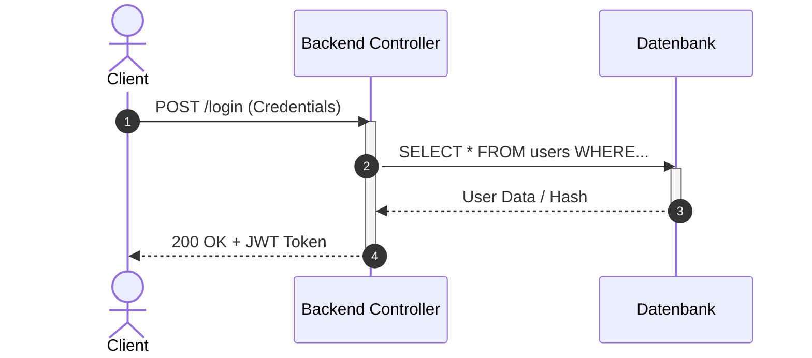

# 05-05: LF 5.2 Sequenzdiagramme, Programmablaufpläne (PAP) & Nassi-Shneiderman-Struktogramme

Dieses Modul behandelt die dynamische Zeitverlaufsmodellierung via UML-Sequenzdiagramm sowie die logische Algorithmenmodellierung mittels PAP (DIN 66001) und Nassi-Shneiderman-Struktogrammen (DIN 66261).

---

## 1. UML Sequenzdiagramm (Sequence Diagram)

Das Sequenzdiagramm zeigt das dynamische Zusammenwirken von Objekten in einer zeitlichen Abfolge.

* **Lebenslinie (Lifeline):** Gestrichelte vertikale Linie, stellt das Vorhandensein eines Objekts über die Zeit dar.
* **Aktivierungsbalken:** Schmaler Balken auf der Lebenslinie, zeigt die Ausführungsdauer einer Operation an.
* **Synchrone Nachricht (`->` mit ausgefüllter Pfeilspitze):** Sender wartet auf die Antwort des Empfängers (blockierend).
* **Asynchrone Nachricht (`->` mit offener Pfeilspitze):** Sender setzt Ausführung fort, ohne auf Antwort zu warten (z. B. Event-Queue/WebSockets).
* **Antwortnachricht (`-->` gestrichelte Linie):** Rückgabe von Daten an den Aufrufer.

---

## 2. Ablauf- und Algorithmenmodellierung: PAP vs. Struktogramm

| Kriterium | Programmablaufplan (PAP / DIN 66001) | Nassi-Shneiderman-Struktogramm (DIN 66261) |
| :--- | :--- | :--- |
| **Strukturprinzip** | Netzplanartig mit freien Flusslinien (Pfeilen). | Bausteinartig / Verschachtelte Blöcke (Keine Pfeile!). |
| **GOTO-Gefahr** | Hoch (Freie Sprünge können zu unübersichtlichem "Spaghetti-Code" führen). | Unmöglich (Zwingt zur strukturierten Programmierung). |
| **Hauptsymbole** | Oval (Start/Stopp), Rechteck (Verarbeitung), Raute (Verzweigung), Parallelogramm (Ein-/Ausgabe). | Rechteck-Blöcke für Sequenzen, Dreiecks-Blöcke für Verzweigungen, Schleifen-Rahmen. |

---

## 3. Grundelemente der Algorithmensteuerung

1. **Sequenz:** Nacheinander auszuführende Anweisungen.
2. **Selektion (Verzweigung):** Bedingte Anweisungen (`IF...THEN...ELSE` oder `SWITCH/CASE`).
3. **Iteration (Schleife):** Wiederholungen (
   * **Kopfgesteuert:** `WHILE (Bedingung)` – Prüfung *vor* der Ausführung.
   * **Fußgesteuert:** `DO...WHILE (Bedingung)` – Mindestens einmalige Ausführung vor Prüfung.
)

---

## FIAE-Zusammenfassung
Entwickler modellieren komplexe API-Kommunikationen und Microservice-Aufrufe zeitlich in Sequenzdiagrammen und entwerfen geschäftskritische Algorithmen vor der Codierung strukurorientiert im Nassi-Shneiderman-Struktogramm.
