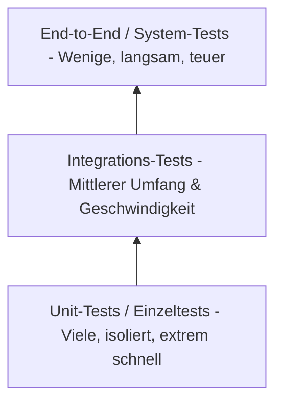

# 05-10: LF 5.5 Teststufen, Testpyramide & Testfallentwurf

Dieses Modul behandelt die Einordnung von Teststufen über die Testpyramide, den Vergleich zwischen Blackbox- und Whitebox-Testing sowie den strukturierten Entwurf formaler Testfälle.

---

## 1. Die Testpyramide & Teststufen im Vergleich

Die **Testpyramide** visualisiert die optimale Verteilung verschiedener Testarten in einem Softwareprojekt.

| Teststufe | Fokus / Ziel | Isolationsgrad | Geschwindigkeit | FIAE-Praxisbeispiel |
| :--- | :--- | :--- | :--- | :--- |
| **Unit Testing (Komponententest)** | Testet isolierte Klassen oder Methoden auf korrekte Funktion. | Hoch (Abhängigkeiten werden gemockt). | Extrem schnell (ms). | `pytest` oder `JUnit` Test für eine Rabatt-Berechnungsfunktion. |
| **Integration Testing** | Testet das Zusammenspiel mehrerer Module/Komponenten. | Mittel (Echte DB/API-Anbindungen). | Moderat. | Prüfung der Schnittstelle zwischen REST-API-Controller und Datenbank. |
| **System Testing (E2E)** | Testet das Gesamtsystem inkl. aller Abhängigkeiten von außen. | Gering (Gesamtsystem auf Staging). | Langsam. | Automatisiertes Durchklicken einer Bestellung via Playwright/Selenium. |

---

## 2. Testing-Methodiken: Blackbox vs. Whitebox

| Kriterium | Blackbox-Testing | Whitebox-Testing |
| :--- | :--- | :--- |
| **Kenntnis des Quellcodes** | Keine Kenntnis (Test erfolgt rein über Input/Output). | Vollständige Einsicht in den Quellcode und die Innenseite des Systems. |
| **Tester-Perspektive** | Anwender-, QA- oder Kundenperspektive. | Softwareentwickler / Code-Reviewer. |
| **Fokus** | Prüfung funktionaler Anforderungen (*Lastenheft/Pflichtenheft*). | Pfadüberdeckung, Abdeckung von Ausnahmezuständen (*Code Coverage*). |
| **Methoden** | Äquivalenzklassenbildung, Grenzwertanalyse. | Kontrollfluss- & Datenflusstests, Statement/Branch Coverage. |

---

## 3. Struktur eines formalen Testfalls (Test Case)

Ein Testfall muss so formuliert sein, dass er **wiederholbar, eindeutig und prüfbar** ist.

| Testfall-Feld | Beschreibung | Beispiel |
| :--- | :--- | :--- |
| **Testfall-ID** | Eindeutige Kennung. | `TC-PAYMENT-001` |
| **Test-Titel** | Kurzbeschreibung des Tests. | Rabattcode "SUMMER10" anwenden |
| **Voraussetzungen (Pre-Conditions)** | Erforderlicher Systemzustand vor Teststart. | Warenkorb enthält Artikel im Wert von 50 €; User ist eingeloggt. |
| **Testschritte (Steps)** | Eindeutige Ausführungsanweisung. | 1. Code "SUMMER10" ins Feld eingeben. 2. Auf "Einlösen" klicken. |
| **Erwartetes Ergebnis** | Das sollmäßige Verhalten aus der Anforderung. | Rabatt von 10 % wird abgezogen. Gesamtsumme aktualisiert sich auf 45 €. Status `200 OK`. |
| **Tatsächliches Ergebnis** | Ist-Zustand nach Ausführung (wird beim Testen erfasst). | Gesamtsumme ist 45 €. |
| **Status** | Testergebnis. | **PASS** / **FAIL** |

---

## FIAE-Zusammenfassung
Entwickler schreiben automatisierte Unit-Tests nach der Testpyramide als Basis der QS, entwerfen nachvollziehbare Testfälle und nutzen Grenzwertanalysen zur Vermeidung von Off-by-One-Fehlern.
