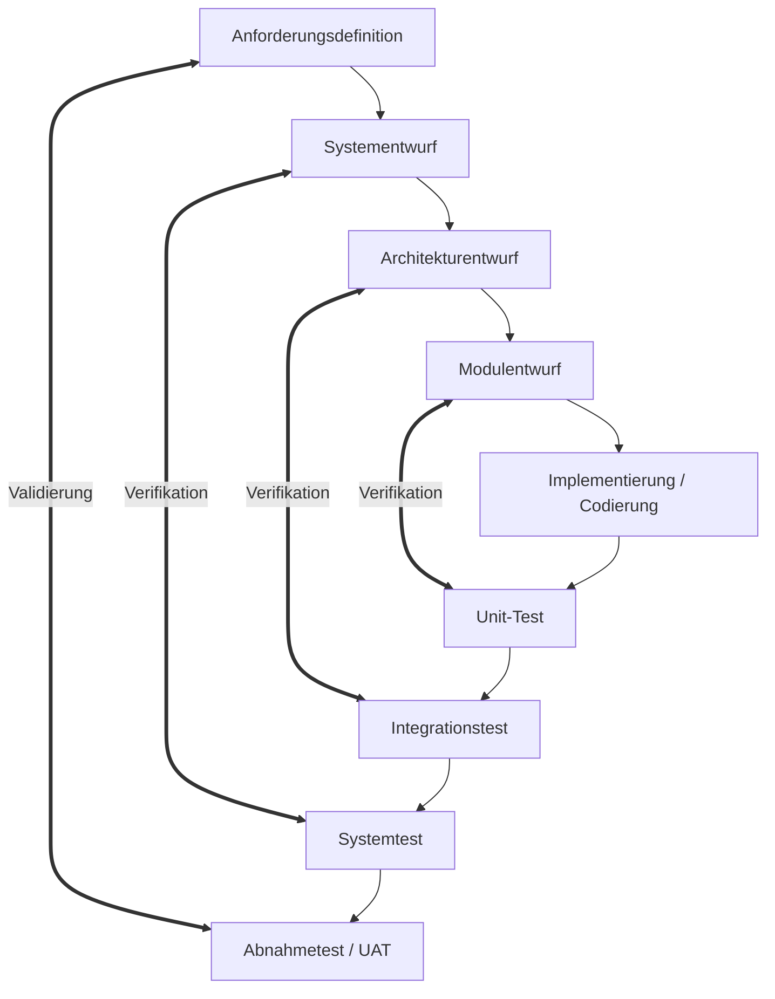

# 05-12: LF 5.6 Klassische Vorgehensmodelle (Wasserfall, Spirale & V-Modell)

Dieses Modul behandelt klassische sequentielle und risikogetriebene Vorgehensmodelle der Softwareentwicklung (Wasserfall, Spiralmodell nach Boehm), die Differenzierung zwischen Verifikation und Validierung sowie das V-Modell.

---

## 1. Klassische Sequentielle Modelle

### Das Wasserfall-Modell
Das Wasserfall-Modell ist ein streng lineares Phasenmodell. Eine Phase beginnt erst, wenn die vorherige vollständig abgeschlossen und dokumentiert ist (*Phase-Gate*).

* **Phasen:** Anforderungsanalyse $\rightarrow$ Systemdesign $\rightarrow$ Implementierung $\rightarrow$ Integration/Test $\rightarrow$ Betrieb/Wartung.
* **Vorteile:** Hohe Planungssicherheit bei stabilen Anforderungen, klare Meilensteine, einfache Dokumentation.
* **Nachteile / Inflexibilität:** Späte Lauffähigkeit der Software, Anforderungsänderungen während des Projekts führen zu massiven Kosten- und Zeitüberschreitungen (*Unflexible Changeprozesse*).

### Das Spiralmodell (nach Boehm)
Ein **risikogetriebenes, iteratives** Modell, bei dem das Projekt wiederholt vier Quadranten durchläuft:
1. **Ziele festlegen:** Anforderungserhebung und Alternativen bestimmen.
2. **Risikoanalyse & Prototyping:** Identifikation und Eliminierung von Projektrisiken (Prototypenbau).
3. **Entwicklung & Test:** Umsetzen des Funktionsumfangs der aktuellen Iteration.
4. **Planung der nächsten Phase:** Review mit Stakeholdern und Vorbereitung der nächsten Runde.

---

## 2. Das V-Modell: Verifikation vs. Validierung

Das V-Modell stellt den Entwicklungsphasen auf der linken Seite direkt entsprechende Testphasen auf der rechten Seite gegenüber.

### Kernunterschied: Verifikation vs. Validierung
* **Verifikation:** *"Bauen wir das Produkt richtig?"* (Prüfung der Übereinstimmung mit den Spezifikationen/Pflichtenheft).
* **Validierung:** *"Bauen wir das richtige Produkt?"* (Prüfung der Eignung für den eigentlichen Einsatzzweck des Kunden/UAT).

### Zuordnung der Phasen im V-Modell

### Frühe Testplanung im V-Modell
Ein zentraler Vorteil des V-Modells ist, dass Testfälle **bereits parallel zur jeweiligen Entwurfsphase** definiert werden (z. B. Entwurf der Acceptance-Tests während der Anforderungserhebung), bevor die erste Zeile Code geschrieben wird.

---

## FIAE-Zusammenfassung
Entwickler nutzen das V-Modell zur frühzeitigen Erstellung von Testfällen während der Designphase und verstehen die Grenzen linearer Modelle (Wasserfall), um den Wechsel zu agilen Vorgehensweisen fachlich zu begründen.
